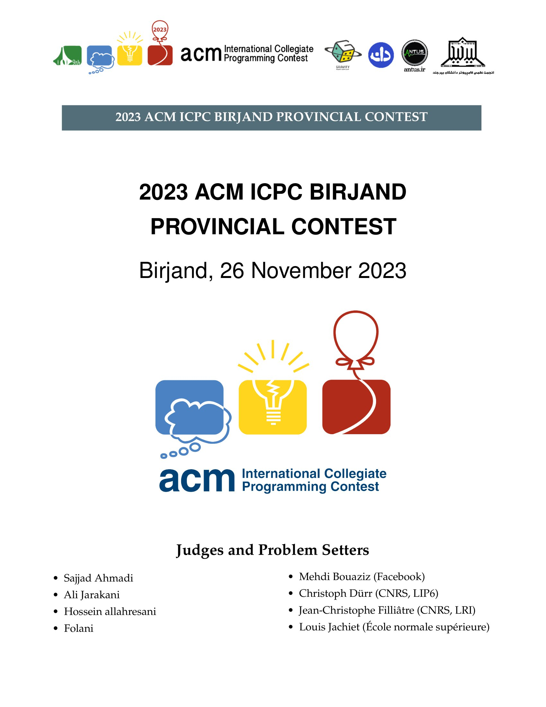
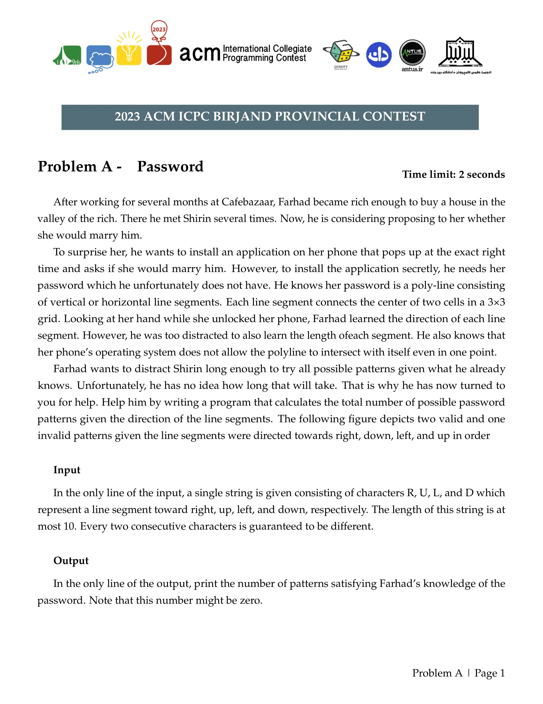

# ACM Contest LaTeX Template for Birjand University

This repository contains a LaTeX template specifically designed for ACM contest problems at Birjand University.

## Overview

The template provides a structured format for presenting ACM contest problems, ensuring consistency and clarity in problem statements. It's tailored to meet the requirements and branding of Birjand University.

## Preview

Here's a preview of the first two pages of the generated PDF:

 

## Usage

1. **Editing Problems:** Navigate to the `problems` directory. Each problem should be placed in its own sub-directory, and the problem statement should be written in a `problem.tex` file within that sub-directory.

2. **Adding Problems:** To add a new problem, create a new sub-directory in the `problems` directory and add the corresponding `problem.tex` file. Ensure that the problem statement adheres to the format provided in the existing problem files.

3. **Updating Main File:** After adding or editing problems, update the `main.tex` file to include the paths to the new or modified problem directories. This ensures that the problems are compiled and included in the final document.

## Contribution

Feel free to fork this repository, make changes, and submit pull requests. Any contributions to improve the template or add new features are welcome!

## License

This template is open-source and free to use. Please ensure to give appropriate credit when using or modifying it for your purposes.

## Acknowledgements

Special thanks to the computer science department of Birjand University for their support and guidance in creating this template.
